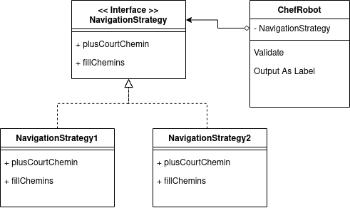

Ensimag 2A POO - TP 2022/23
============================
Réalisé par Paul Vernin, Marc Félix-Henry et Paul Bonmariage.

## Installation du jeu
Pour lancer le jeu, il faut soit :
- utilise un formidable IDE tel que Intellij IDEA :) (la configuration pour run est déjà faite, elle est dans .idea/runConfigurations/main_Main.xml)

### Input
La commande `java Main` prend 2 arguments :
- 1 : le chemin vers la carte à charger
- 2 : la stratégie à utiliser

### Output
Tous les ``System.out.println`` sont redirigés vers un fichier ``logs/out.txt``.\
Tous les ``System.err.println`` sont redirigés vers un fichier ``logs/err.txt``.

# Compte rendu

## Modèle MVC
On s'est inspiré du très connu modèle MVC (Model View Controller) pour structurer notre projet. Le modèle MVC est un modèle de conception logiciel qui sépare les données d'une application, la logique métier et la présentation. Il est composé de trois éléments : le modèle, la vue et le contrôleur.\
Dans notre cas la partie vue était déjà réalisé en grande partie à l'aide de la librairie GUI fournie par les enseignants. Il n'y a que la méthode `draw()` du simulateur qui a un comportement spécifique à la vue mais on a préféré pas séparer cette méthode dans un petit package.\
La partie modèle est représenté par l'ensemble des classes du package model.\
La partie contrôleur est représenté par l'ensemble des classes du package controller.

## Gestion plus court chemin
Nous avons utilisé l'algorithme de Dijkstra pour calculer le plus court chemin entre deux points.\
Nous avons utilisé une implémentation de la classe PriorityQueue fournie par la librairie Java Collections Framework.\

## Chef robot (Design Pattern Singleton (single-threaded))
Vu qu'il n'existe qu'un seul chef robot dans l'application nous avons utilisé le design pattern Singleton pour s'assurer qu'il n'y ait qu'une seule instance de la classe ChefRobot.\
(En apprendre plus sur le design pattern Singleton : https://refactoring.guru/design-patterns/singleton)

## Gestion des stratégies (Design Pattern Strategy)
En s'inspirant du design pattern Strategy nous avons implémenté deux stratégies pour calculer le plus court chemin.\
La classe ChefRobot avait le rôle du Navigateur, c'est lui qui possède la stratégie dans ses attributs.

\
(En apprendre plus sur le design pattern Strategy : https://refactoring.guru/design-patterns/strategy)\

## Gestion des robots par le Chef robot (Design Pattern Observer)
On voulait éviter de surcharger d'appels les classes robots et incendies.\
C'est-à-dire que dans une implémentation simpliste, le chef robot appellerait toutes les classes robots et incendies pour leur demander "Est ce que vous êtes disponibles ?" à chaque fois qu'on appelle `next()`\
Donc si un robot était occupé pour une suite d'événements qui durerait 300 tours, le chef robot appellerait 300 fois la classe robot pour rien.\
Pour palier à ce problème nous avons implémenté le design pattern Observer avec quelques modifications pour que cela colle à nos besoins.\

Une fois que le chef robot a fini d'assigner tous les robots à des incendies, il va se mettre en "off" et c'est un des robots qui va réveiller le chef robot.\
Donc à la place d'avoir une fonction next qui fait :
```
next():
    Pour chaque robot si il est disponible:
        Pour chaque incendie s'il n'est pas pris en charge:
            ...calculer chemins, etc...

```
On aura :
```
next():
    Si chef robot est "on":
        Pour chaque robot si il est disponible:
            Pour chaque incendie s'il n'est pas pris en charge:
                ...calculer chemins, etc...
```
Cela réduit la complexité de la méthode ``next()`` qui est beaucoup appelée par le simulateur.\
Pour palier à ce problème, on a implémenté le design pattern Observer.\
En apprendre plus sur le design pattern Observer : https://refactoring.guru/design-patterns/observer\

## Linting
Nous avons utilisé le linter SonarLint pour vérifier la qualité du code.\
Cela nous a permi de structurer notre code pour suivre les conventions de programmation en Java comme par exemple le nommage des variables, des fonctions, des classes, etc.\
Et surotut faire en sorte que chaque membre de l'équipe suive les mêmes conventions de programmation pour avoir un code plus lisible et plus facile à maintenir.

## Testing
Pour tester la partie modèle de l'application nous avons utilisé le framework JUnit afin de réaliser principalement des tests unitaires.


Intellij IDEA
Logger
